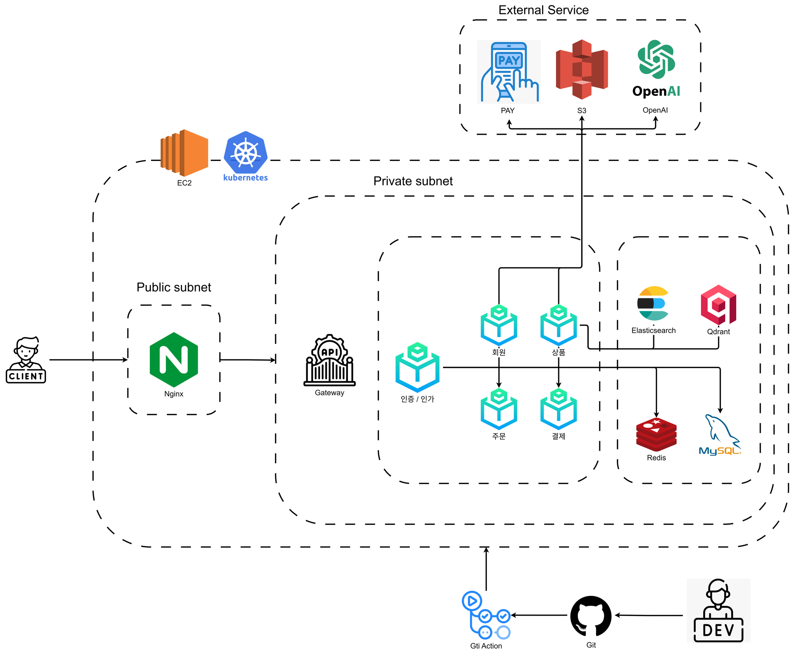
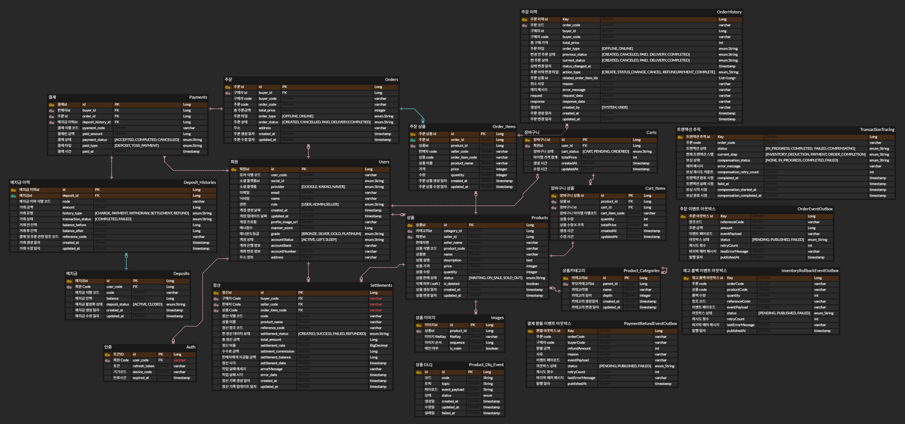

## ✏️ 프로젝트 개요
아이돌·애니메이션 굿즈를 수집하는 이용자를 위해, 신뢰할 수 있는 거래 환경과 안전한 결제·정산 시스템을 제공하는 굿즈 전용 중고거래 플랫폼입니다.

## 📪 배포 링크
### [Gooream](https://gooream.chlab.org/)

## 📆 개발 기간
| 구분           | 기간                              | 주요 내용                                                                                        | 비고              |
| ------------ |---------------------------------| -------------------------------------------------------------------------------------------- | --------------- |
| **총 개발 기간**      | **2024.11.03 (월) ~ 2024.12.18 (월)** | **기획 → 설계 → 개발 → 배포 → 통합 테스트 전 과정 수행**                                                           |    |
| 사전 기획·설계     | 2024.11.03 (월) ~ 2024.11.06 (목) | 프로젝트 주제 선정, 요구사항 정리, 팀 역할 분담, API 명세 정의, ERD 설계, 전체 서비스 플로우 정의                               | 코드 컨벤션 수립       |
| 핵심 기능 개발     | 2024.11.07 (금) ~ 2024.11.17 (월) | 회원/인증, 상품, 장바구니, 주문·결제, 예치금, 정산 모듈 개발, Kafka 이벤트 구현, Spring Batch 정산 처리, Elasticsearch 검색 구현 | 테스트 코드 및 디버깅 병행 |
| 배포 환경 통합 테스트 | 2024.11.14 (금) ~ 2024.11.18 (화) | 팀 단위 통합 테스트, API Gateway 연동, 실배포 환경 기능 연동 테스트, Nginx Reverse Proxy 및 SSL 설정                  | AWS EC2 배포      |
| 인프라 개선·리팩토링  | 2024.11.26 (금) ~ 2024.11.30 (일) | Kubernetes 환경 구축, 도메인 리팩토링                                                                   | 클러스터 환경 구성      |
| 핵심 도메인 통합    | 2024.12.01 (월) ~ 2024.12.09 (화) | 주요 모듈 병합(cart-product / payment-settlement-deposit), 조회 구조 정리, 추천 기능 구현, 배포 자동화              | CI/CD 구성        |
| 기능 안정화       | 2024.12.10 (수) ~ 2024.12.18 (목) | 기능 안정화, 동시성·정합성 보완, 통합 테스트                                                                   | 마무리 단계          |

## 👨‍💻 개발인원 및 역할
|                                          PO                                          |                                        Infra                                         |                                          BE                                          |                                          BE                                           |                                          BE                                          |
|:------------------------------------------------------------------------------------:|:------------------------------------------------------------------------------------:|:------------------------------------------------------------------------------------:|:-------------------------------------------------------------------------------------:|:------------------------------------------------------------------------------------:|
|  |  |  |  |  |
|                          [이승현](https://github.com/Dianuma)                           |                          [김예성](https://github.com/yuio7279)                          |                       [김호남](https://github.com/tigerpoint123)                        |                        [신호영](https://github.com/Signalzero94)                         |                        [김민석](https://github.com/98minseok)                        |
|                  프로젝트 일정 관리,  예치금 및 정산 설계,  Kafka·Batch 설계                   |            Docker·Kubernetes 환경 구성,  AWS EC2 배포,  CI/CD 파이프라인 구축             |                                     주문 모듈 구현,  외부 PG 결제 연동,  주문·결제 트랜잭션 정합성 보장                                      |                             상품 도메인,  Elasticsearch 검색,  AI 기반 상품 추천                             |                               회원·인증/인가,  JWT·Redis 토큰 관리,  API Gateway 연동                                |

## 🔊 프로젝트 주요 기능

### 회원 및 인증
- 이메일 및 소셜 로그인(Google / Naver) 지원
- JWT 기반 인증·인가 및 Spring Security 적용
- 기기별 로그인 상태 관리
- Redis 기반 Refresh Token 관리로 인증 성능 및 안정성 확보

### 상품 관리 및 검색
- 상품 등록·수정·삭제·상태 변경 기능 제공
- S3 기반 상품 이미지 업로드
- Elasticsearch 기반 상품 검색
  - 키워드 검색, 가격대 및 판매자 유형 필터링
  - 이벤트 기반 색인 동기화로 검색 데이터 정합성 유지
- 장바구니를 통한 다건 상품 묶음 구매 지원

### 거래 및 결제
- 상품 상세 페이지 및 장바구니 기반 주문·결제 흐름
- 예치금 결제 및 외부 결제 API(Toss) 연동
- 주문·결제·재고 흐름에 비관적 락 적용으로 동시성 및 데이터 정합성 보장
- Kafka 기반 이벤트 처리 및 Outbox 패턴 적용

### 정산 시스템
- Spring Batch 기반 월 단위 판매자 정산 처리
- 정산 실패·재시도·보상 시나리오를 고려한 정산 로직 구현

### 개인화 상품 추천
- 사용자 조회·검색·장바구니 이력 데이터 수집
- Redis 기반 단기 관심사, RDB 기반 장기 관심사 관리
- Vector DB(Qdrant)를 활용한 임베딩 데이터 저장
- LLM 기반 추천 쿼리 생성 및 개인화 상품 추천 제공

### 인프라 및 운영 환경
- Docker 기반 컨테이너화 및 AWS EC2 배포
- Kubernetes 도입을 통한 무중단 배포 및 롤링 업데이트
- API Gateway 및 Nginx Reverse Proxy 기반 트래픽 분산 및 보안 강화
- GitHub Actions 기반 CI/CD 파이프라인 구축
- GitHub Secrets를 활용한 환경 변수 및 민감 정보 관리

## 🖥 System Design
### Architecture Diagram

### ERD

## 🛠 Tech Stack
- ### **Development**  
    
   
    
  
    

- ### **Database & Cache**  
   
    
   
  

- ### **Event Streaming & Messaging**  
  

- ### **Batch Processing**  
  

- ### **Search & Indexing**  
  

- ### **AI / Recommendation**  
   
  

- ### **Authentication & Security**  
   
   
  

- ### **Docs & API Testing**  
   
  

- ### **Infra & Deployment**  
  
    
  
     
   
  

- ### **Collaboration Tools**  
    

